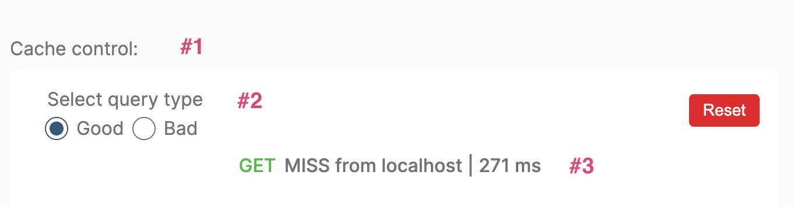

# Automatic Persisted Queries

With GraphQL, clients send queries to the server as HTTP requests that include the query string to execute. Unfortunately, the size of a query string can become quite large, which can negatively impact network performance.

To resolve this issue, Brightspot supports two types of [persisted](https://www.brightspot.com/documentation/brightspot-cms-developer-guide/graphql-understanding-persisted-queries) queries: [automatic](https://www.apollographql.com/docs/apollo-server/performance/apq/) (APQ) and [static](https://www.apollographql.com/blog/apollo-client/persisted-graphql-queries/) (SPQ).

Persisted queries positively impact network performance in two ways:

1. By sending a smaller query string in the network request.
2. By enabling the use of the HTTP `GET` method for query network requests (since the query size is small enough to use `GET`), thus making it possible to take advantage of the browser cache and [integrate with a CDN](https://www.apollographql.com/docs/apollo-server/performance/apq/#using-get-requests-with-apq-on-a-cdn).

This example demonstrates how to use APQs with Brightspot and [Apollo Client](https://www.apollographql.com/docs/react/), using [best practices](https://www.apollographql.com/docs/react/data/operation-best-practices/) for GraphQL queries. The example configuration provides a mock CDN to demonstrate the performance benefits possible with APQs and CDNs.

## What you will learn

1. [Enable APQs in Brightspot](#1-enable-apqs-in-brightspot).
2. [Configure a front-end application to use APQs with Brightspot](#2-configure-a-front-end-application-to-use-apqs-with-brightspot).

## Running the example application

> **_Note_** Just starting? Refer to the [README](/README.md) at the root of the `react-examples` repository for details on running example applications in depth.

### Install dependencies

Run the following command from the `automatic-persisted-queries/app` directory:

```sh
$ yarn
```

```
[1/4] 🔍 Resolving packages...
[2/4] 🚚 Fetching packages...
[3/4] 🔗 Linking dependencies...
[4/4] 🔨 Building fresh packages...
✨ Done in 6.03s.
```

Run the following command to start up the front-end application:

```sh
$ yarn dev
```

## Using the example application

#### Front end:

The front end is a [Next.js](https://nextjs.org/) application.

The UI displays an Aviation Alphabet Converter page (option to use either an input field or checkboxes to convert letters). Both the text input and checkboxes run a GraphQL query to fetch data.

Key points to observe in the UI:

1.  **Cache control** : Value displays if a cache-control response header is set in Brightspot.
2.  **Select query type** : "Good" query types implement best practices for queries and "Bad" query types implement practices to avoid. For details on implementation refer to the comments found in the query files in `app/queries`.
3.  Query execution details: `GET` or `POST` for HTTP method used, `MISS` or `HIT` for CDN caching, and query execution time in milliseconds.

| UI Key Points                                            |
| -------------------------------------------------------- |
|  |

#### Brightspot:

To add a cache-control header to query responses, navigate to: **&#x2630;** &rarr; **Admin** &rarr; **APIs** &rarr; **Endpoints** &rarr; **Aviation Alphabet Endpoint**. In the **Cache Control** field, enter `max-age=80000`. In the browser, trigger a network request to see the cache-control value display in the UI. You will also notice that `HIT` will appear for responses that are [cached](https://www.cloudflare.com/learning/cdn/what-is-caching/) by the CDN. Execution time will vary based on `HIT` or `MISS`.
Refer to MDN's [cache control documentation](https://developer.mozilla.org/en-US/docs/Web/HTTP/Headers/Cache-Control) for more information on configuring cache control.

#### View query requests and responses:

In the `app/.env` file, set the `LOGGER` environment variable to `true` to turn logging on for query requests and responses.

Example logging:

```sh
🚀 network call:  1
HTTP method:  GET # first request is always a GET request
request url:  http://localhost/graphql/delivery/apq/?operationName=GetTextBad&operationName=GetTextBad&variables=%7B%7D&extensions=%7B%22persistedQuery%22%3A%7B%22version%22%3A1%2C%22sha256Hash%22%3A%229083c29a3ca5ca35fab711038e77c279570ee9c4a8877570dcc25bec56054eb4%22%7D%7D
✅ response:  { errors: [ { message: 'PersistedQueryNotFound' } ], data: null } # error returned if Brightspot doesn't recognize the hash.

🚀 network call:  2
HTTP method:  POST  # second query sent as a POST. Brightspot validates the hash, stores the query, processes the request, and returns the result.
request url:  http://localhost/graphql/delivery/apq
POST Body:  {
  query: 'query GetTextBad {\n' +
    '  AviationAlphabetEndpoint {\n' +
    '    converter(text: "qhmvbb") {\n' +
    '      output\n' +
    '      text\n' +
    '      __typename\n' +
    '    }\n' +
    '    __typename\n' +
    '  }\n' +
    '}',
  variables: {},
  extensions: {
    persistedQuery: {
      version: 1,
      sha256Hash: '9083c29a3ca5ca35fab711038e77c279570ee9c4a8877570dcc25bec56054eb4'
    }
  }
}
✅ response:  {
  data: {
    AviationAlphabetEndpoint: { converter: [Object], __typename: 'AviationAlphabetEndpoint' }
  }
}
```

> **_Note_** In an application that uses client-side data fetching (this application uses [API Routes](https://nextjs.org/docs/api-routes/introduction)), you can see the network requests and responses in the browser console network tab.

Ideally, you want to avoid unneccessary `POST` requests by using query best practices, since a `POST` request using APQ actually decreases network performance (since two queries are sent instead of one).

## How everything works

#### 1. Enable APQs in Brightspot

- [Create a persisted query protocol class](brightspot/src/brightspot/example/automatic_persisted_queries/CustomAPQProtocol.ts): A persisted query protocol implements `AutomaticPersistedQueryProtocol`, which enables generating a persisted query extension (the hashed value of a query), and getting queries by hash. The protocol must provide the following methods:

  - `getSharedSecret`: This method sets a secret (or [salt](<https://en.wikipedia.org/wiki/Salt_(cryptography)#:~:text=In%20cryptography%2C%20a%20salt%20is,to%20safeguard%20passwords%20in%20storage>)) to increase security - only clients that hash queries along with the respective salt are valid. Return an empty string if a salt isn't desired.

    ```typescript
    [`getSharedSecret()`](): string {
      return 'secret'
    }
    ```

  - `getHashAlgorithm`: Brightspot provides a `Sha256PersistedQueryHashAlgorithm` class for generating query hashes. You can also add a custom hash algorithm.

    ```typescript
    [`getHashAlgorithm()`](): AutomaticPersistedQueryHashAlgorithm {
        return new Sha256PersistedQueryHashAlgorithm()
    }
    ```

- Define your persisted query protocol in the [endpoint](brightspot/src/brightspot/example/automatic_persisted_queries/AviationAlphabetEndpoint.ts):

  ```typescript
  [`getPersistedQueryProtocol()`](): PersistedQueryProtocol {
      let CustomAPQProtocol = ClassFinder.getClass(
        'brightspot.example.automatic_persisted_queries.CustomAPQProtocol'
      )
    return new CustomAPQProtocol()
    }
  ```

> **_Note_** Adding cache-control response headers is optional but recommended if using a CDN.

- Add cache control headers to the [endpoint view model](brightspot/src/brightspot/example/automatic_persisted_queries/AviationAlphabetEndpoint.ts):

  ```typescript
    onCreate(response: ViewResponse) {
      super.onCreate(response)
      if (this.model.cacheControl) {
        response.addHeader('Cache-Control', this.model.cacheControl) // The `cache-control` value comes from the `cacheControl` field set on the endpoint.
      }
    }
  ```

#### 2. Configure a front-end application to use APQs with Brightspot

- Create an [Apollo Client instance](app/lib//client.ts): This example adds a salt, so customization is needed. Follow the instruction for [Apollo Client setup](https://www.apollographql.com/docs/apollo-server/performance/apq/#apollo-client-setup) if no customization is needed.

  ```typescript
  const persistedQueriesLink = createPersistedQueryLink({
    generateHash: async (query: DocumentNode) => {
      const secret = process.env.SECRET_KEY! // Must be the same salt defined in the persisted query protocol in Brightspot
      const message = secret.concat(print(query))
      const result = await sha256(message) //The hashing algorithm used must be the same as that defined in `the Brightspot persisted query protocol
      return result
    },
    useGETForHashedQueries: true,
  })
  ```

- [Configure environment variables if needed](app/.env):
  `SECRET_KEY`: Salt set in the Brightspot persisted query protocol.
  `GRAPHQL_URL`: URL for the Brightspot GraphQL API endpoint.
  `NEXT_PUBLIC_HOST`: URL for the front-end application. This is used to make fetch requests using Next.js API Routes.
  `LOGGER`: set value to true to view query requests and responses in your terminal.

## Troubleshooting

Having issues running the example application? Refer to the [Common Issues](/README.md) section in the repository README for assistance.
