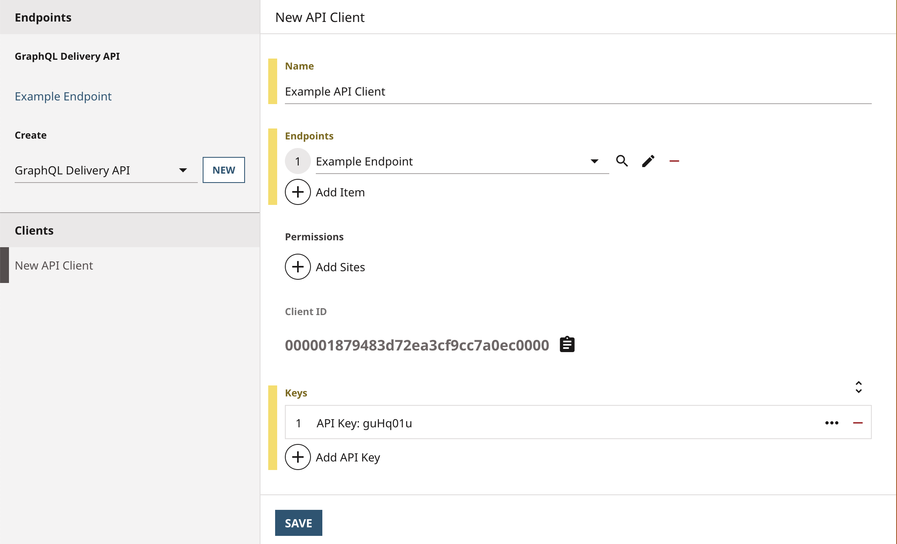

# Client Authentication

Previous examples, like [Content Delivery](https://github.com/brightspot/react-examples/tree/main/content-delivery), create a GraphQL endpoint that is open, allowing any user or application to access it. When developing an API, it is important to decide which users or applications are allowed to access an endpoint.

Brightspot supports API keys through its API Client system. This example demonstrates how to create a GraphQL endpoint that requires an API key and shows how to fetch data from it.

## What you will learn

1. [Restrict access to the endpoint.](#step-1-restrict-access-to-the-endpoint)
1. [Create an API Client and API Key.](#step-2-create-an-api-client-and-api-key)
1. [Query the endpoint.](#step-3-query-the-endpoint)

## Running the example application

> **_Note:_** Just starting? Refer to the [README](/README.md) at the root of the `react-examples` repository for details on running example applications.

### Create an API Client

In Brightspot, navigate to **☰** &rarr; **Admin** &rarr; **APIs** &rarr; **Clients** &rarr; **New API Client** and add a name, add the `Fun Fact Endpoint` to the `Endpoints` field, and add an API Key. Then copy the Client ID and API Key into the matching variables in the `app/.env` file. Finally, click **Save**.

> **_Note:_** There are four fields that need to be modified in the `app/.env` file: `GRAPHQL_CLIENT_ID`, `GRAPHQL_CLIENT_API_KEY`, `NEXT_PUBLIC_GRAPHQL_CLIENT_ID`, and `NEXT_PUBLIC_GRAPHQL_CLIENT_API_KEY`.

### Install dependencies

```sh
$ yarn
```

```
[1/4] 🔍 Resolving packages...
[2/4] 🚚 Fetching packages...
[3/4] 🔗 Linking dependencies...
[4/4] 🔨 Building fresh packages...
✨ Done in 6.03s.
```

### Start the Next.js app

```sh
$ yarn dev
```

```
ready - started server on 0.0.0.0:3000, url: http://localhost:3000
```

The front-end application will open automatically in the browser.

## Using the example application

The Next.js app makes requests to the GraphQL endpoint. The requests include HTTP headers that contain a client ID and secret API key. If the value of the client ID and API key in the headers match the values stored in Brightspot then the app will display the data returned.

The app is split into two sections, one that uses [Client-side rendering](https://nextjs.org/docs/basic-features/data-fetching/overview) to fetch data after the page has loaded and the other uses [Server-side rendering](https://nextjs.org/docs/basic-features/data-fetching/get-server-side-props) to fetch data before the page has loaded.

> **_Note:_** The client ID and secret API key are public in the client-side rendering part of the app.

To show how the application responds to an incorrect API Key, modify the `NEXT_PUBLIC_GRAPHQL_CLIENT_API_KEY` and/or `GRAPHQL_CLIENT_API_KEY` values in the `.env` file located at `client-authentication/app` to some new value. Then restart the Next.js app and navigate to it in your web browser.

## How everything works

### 1. Restrict access to the endpoint

An endpoint can be made to require an API Key by implementing the `getApiAccessOption()` method and returning a new instance of the `GraphQLApiAccessOptionExplicit()` class.

```ts
getApiAccessOption(): GraphQLApiAccessOption {
  return new GraphQLApiAccessOptionExplicit()
}
```

### 2. Create an API Client and API Key

An API Client can be created in Brightspot at **☰** &rarr; **Admin** &rarr; **APIs** &rarr; **Clients** &rarr; **New API Client**. The associated endpoints can be added to the `Endpoints` field and API keys can be managed through the `Keys` field.

| API Client Form                                                                               |
| --------------------------------------------------------------------------------------------- |
|  |

### 3. Query the endpoint

The GraphQL endpoint checks each incoming HTTP request for `X-Client-Id` and `X-Client-Secret` headers and compares the values to the endpoint's API Client ID and API keys. If the headers are missing or incorrect it returns a 401 Unauthorized response.

This example uses the [Fetch API](https://developer.mozilla.org/en-US/docs/Web/API/Fetch_API) to send requests to the endpoint with the required headers. The `ClientSideRender` component sends the request on an event trigger and the `ServerSideRender` component gets the same data passed in as props from a request made on the Next.js server.

> **_Note:_** It is best practice to use a proxy server (like a Next.js server) to make any HTTP requests that include an API key so that they are hidden from the public.

[ClientSideRender.tsx](./app/components/ClientSideRender.tsx)

```ts
// Client-side Rendering

const handleClick = () => {
  fetch(`${process.env.NEXT_PUBLIC_GRAPHQL_URL}`, {
    method: 'POST',
    headers: {
      'X-Client-Id': process.env.NEXT_PUBLIC_GRAPHQL_CLIENT_ID ?? '',
      'X-Client-Secret': process.env.NEXT_PUBLIC_GRAPHQL_CLIENT_API_KEY ?? '',
      // WARNING: Secret key is exposed in web browser
    },
    body: JSON.stringify({
      query: getAllFunFactsQuery,
    }),
  })
```

[index.tsx](./app/pages/index.tsx)

```ts
// Server-side Rendering

export const getServerSideProps: GetServerSideProps = async () => {
  const res = await fetch(`${process.env.GRAPHQL_URL}`, {
    method: 'POST',
    headers: {
      'X-Client-Id': process.env.GRAPHQL_CLIENT_ID ?? '',
      'X-Client-Secret': process.env.GRAPHQL_CLIENT_API_KEY ?? '',
      // Secret key is hidden behind Next.js server
    },
    body: JSON.stringify({
      query: getAllFunFactsQuery,
    }),
  })

  const data = await res.json()

  return { props: data }
}
```

## Troubleshooting

Refer to the [Common Issues](/README.md) section in the respository README for assistance.
