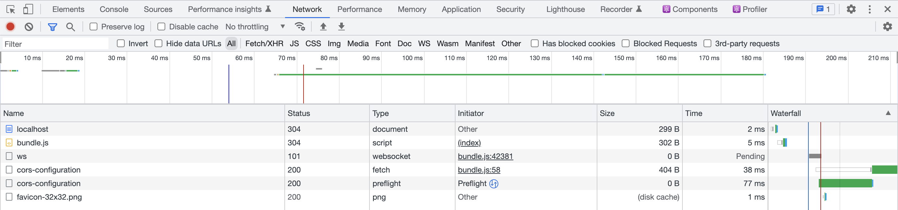

# CORS Configuration

Cross Origin Resource Sharing ([CORS](https://developer.mozilla.org/en-US/docs/Web/HTTP/CORS)) is an HTTP-header based mechanism that enhances security by allowing a server to specify which origins can access its resources. It relaxes the [Same Origin Policy](https://developer.mozilla.org/en-US/docs/Web/Security/Same-origin_policy), and prevents [Cross Site Request Forgery](https://owasp.org/www-community/attacks/csrf). While CORS is an effective security measure, improper configuration can lead to errors and block front-end applications from retrieving or sending data to the server. This example describes how to resolve those errors.

## What you will learn

1. [Debug common CORS issues](#step-1-debug-common-cors-issues)
1. [Cache preflight requests](#step-2-cache-preflight-requests)
1. [Summary of programmatic configuration](#step-3-summary-of-programmatic-configuration)

## Running the example application

Refer to the [README](/README.md) at the root of the `react-examples` repository for details on running example applications in depth. Make sure you have the Docker instance for the example applications running, then follow the quick-start steps starting in the `cors-configuration/` directory:

To upload JavaScript classes in Brightspot (http://localhost/cms):

```sh
cd brightspot
yarn
npx brightspot types download
npx brightspot types upload src
```

To start the front end, run the following commands from the `cors-configuration/app/` directory:

```sh
yarn
yarn start
```

The front-end application opens automatically in the browser, displaying `Loading...`.

## How everything works

### Step 1. Debug common CORS errors

The following sections describe CORS errors intentionally included in this example application and how to resolve them.

#### Error 1: Preflight request doesn't pass access control check

Open the developer console in your browser to see the following CORS error:

`Access to fetch at 'http://localhost/graphql/delivery/cors-configuration' from origin 'http://localhost:3000' has been blocked by CORS policy: Response to preflight request doesn't pass access control check: No 'Access-Control-Allow-Origin' header is present on the requested resource. If an opaque response serves your needs, set the request's mode to 'no-cors' to fetch the resource with CORS disabled.`

This common error occurs when a server and a front-end application are hosted on different domains, and the front-end application's domain has not been added to the server's allowed origins list.

To resolve this error, do the following:

1. Open the file `brightspot/src/brightspot/example/cors_configuration/CorsConfigurationEndpoint.ts`.
1. Uncomment the following line:

   ```js
   graphQLCorsConfiguration.addAllowedOrigin('localhost')
   ```

1. Save the file and upload your Brightspot types.

#### Error 2: Request header not allowed 

Start up your front-end application or refresh it if it is still running, and open the developer console to see the following CORS error.

```Access to fetch at 'http://localhost/graphql/delivery/cors-configuration' from origin 'http://localhost:3000' has been blocked by CORS policy: Request header field foo is not allowed by Access-Control-Allow-Headers in preflight response.```

This error indicates the front-end application’s request header `foo` is being blocked.

To resolve this error, do the following:

1. Open the file `brightspot/src/brightspot/example/cors_configuration/CorsConfigurationEndpoint.ts`.
1. Uncomment the following line:

   ```js
   graphQLCorsConfiguration.addAllowedHeader('foo')
   ```

1. Save the file and upload your Brightspot types.

Refresh the front-end application, and open the developer console. There are no longer any CORS errors.

### Step 2: Cache preflight requests

Before sending an actual request to a server, the browser first sends a [preflight request](https://developer.mozilla.org/en-US/docs/Glossary/Preflight_request). If the preflight request fails, you will run into the CORS errors listed above (and possibly others in a production environment). 

Open the developer console and navigate to the **Network** tab. Under **Name**, there are two `cors-configuration` requests. Before the first POST request is made, a preflight request is sent with the [OPTIONS](https://developer.mozilla.org/en-US/docs/Web/HTTP/Methods/OPTIONS#preflighted_requests_in_cors) method. The POST requests will not be sent until the server responds approving the request.

| CORS Configuration Network Tab                                      |
| ------------------------------------------------------------------- |
|  |

Making two requests every time a client sends an API call to the server will affect performance. One strategy to mitigate the performance hit is to cache the preflight request for a specified amount of time. Brightspot supports the [Access-Control-Max-Age](https://developer.mozilla.org/en-US/docs/Web/HTTP/Headers/Access-Control-Max-Age) header, allowing you to cache preflight requests. You implement this header by doing the following:

1. Open the file `brightspot/src/brightspot/example/cors_configuration/CorsConfigurationEndpoint.ts`.
1. Uncomment the line `graphQLCorsConfiguration.setMaxAge(30)`. 
1. Save the file and upload your Brightspot types.

Start up your front-end application again, or refresh if it is still running. Open the developer console and look at the **Network** tab. There will be two requests as before. Refresh the page within 30 seconds. Because the `Access-Control-Max-Age` is set for 30 seconds, there browser does not send an explicit pre-flight request. When you refresh the page after 30 seconds, the browser sends a new pre-flight request.

### Step 3. Summary of programmatic configuration

The file `brightspot/src/brightspot/example/cors_configuration/CorsConfigurationEndpoint.ts` contains the method `updateCorsConfiguration`. This method provides the class `GraphQLCorsConfiguration` that itself contains the following methods:

* `addAllowedOrigin`: Adds an allowed origin.
* `addAllowedHeader`: Adds an allowed header.
* `setMaxAge`: Specifies the length of time pre-flight requests are cached.

The following file is an example of calling the above methods.

```js
updateCorsConfiguration(
  graphQLCorsConfiguration: GraphQLCorsConfiguration
): void {
  super.updateCorsConfiguration(graphQLCorsConfiguration)

  graphQLCorsConfiguration.addAllowedOrigin('localhost')

  graphQLCorsConfiguration.addAllowedHeader('foo')

  graphQLCorsConfiguration.setMaxAge(30)
}
```

## Troubleshooting

Having issues running the example application? Refer to the [Common Issues](/README.md) section in the respository README for assistance.
