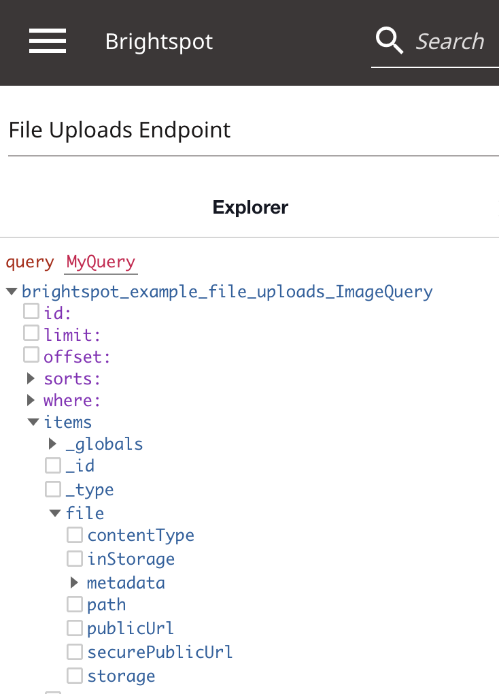

# File Uploads
Since the official GraphQL specification does not mention file uploading, Brightspot's [Content Management API (CMA)](https://www.brightspot.com/documentation/brightspot-cms-developer-guide/hello-content-management-api) implements a popular community extension to the [GraphQL multipart request specification](https://github.com/jaydenseric/graphql-multipart-request-spec).

This example demonstrates uploading files from a front-end application to Brightspot using a [Content Management API (CMA)](https://www.brightspot.com/documentation/brightspot-cms-developer-guide/hello-content-management-api) endpoint, since uploading files is GraphQL mutation (an update or deletion of data). This example use the [apollo-upload-client](https://github.com/jaydenseric/apollo-upload-client) package.  
## What you will learn
1. [Upload files to Brightspot using GraphQL](#1-Upload-files-to-Brightspot-using-GraphQL).
2. [Fields provided from the Brightspot GraphQL API when using the Storage Item field type](#2-Fields-provided-from-the-Brightspot-GraphQL-API-when-using-th-Storage-Item-field-type).
3. [Use MIME Type annotations for limiting file upload types](#3-Use-MIME-Type-annotations-for-limiting-file-upload-types).

## Running the example application

> **_Note_** Just starting? Refer to the [README](/README.md) at the root of the `react-examples` repository for details on running example applications in depth.

Run the following commands from the `brightspot-routing/app` directory:

### Install dependencies

```sh
$ yarn
```

```
[1/4] 🔍 Resolving packages...
[2/4] 🚚 Fetching packages...
[3/4] 🔗 Linking dependencies...
[4/4] 🔨 Building fresh packages...
✨ Done in 6.03s.
```

### Start the React app

```sh
$ yarn start
```

```
Compiled successfully!
```

The React app opens automatically in the browser.

## Using the example application
The front-end application displays **Image** items stored in Brightspot. 

Once you have the front-end application running, select an image to upload. 
1. Click **Upload Image** in the browser. 
2. You should see your image appear. If you select a file that is not an image, Brightspot returns an error in the browser. You can delete uploaded images by clicking the **X** on the top right of the image card. 
3. Click on the information icon on the top left of the image card to view metadata for the image.
 
## How everything works

### 1. Upload files to Brightspot using GraphQL

To upload files to Brightspot, use the `StorageItem` field type for the respective `JavaField`: 

[Image.tsx](./brightspot/src/brightspot/example/file_uploads/Image.ts)

```typescript
  @JavaField(StorageItem)
  file: StorageItem
```

In the front-end application, use the `createUploadLink` provided from the apollo-upload-client package. This function creates a terminating Apollo Link for Apollo Client that fetches a GraphQL multipart request if the GraphQL variables contain files. 

[index.tsx](./app/src/index.tsx)

```typescript
const link = createUploadLink({
  uri: process.env.REACT_APP_GRAPHQL_URL,
  headers: {
    'X-Client-ID': process.env.REACT_APP_CLIENT_ID,
    'X-Client-Secret': process.env.REACT_APP_CLIENT_SECRET,
  },
}) as unknown as ApolloLink
```

Refer to the [Brightspot Documentation](https://www.brightspot.com/documentation/brightspot-cms-developer-guide/uploading-files-in-brightspot-content-management-api) for an example of uploading a file with a CMA endpoint without using Apollo Client.

> **_Note_** This is purely an example application. In your production environment, it is important to hide API Keys that are used for the CMA endpoint. 

### 2. Fields provided from the Brightspot GraphQL API when using the Storage Item field type

To view the available fields provided when using the `StorageItem` field type, use the GraphQL Explorer. Go to the navigation menu → **GraphQLExplorer** , then select the **File Uploads Endpoint** to query for Images. Make sure **Query** is selected on the bottom left pane (the default). Under `items`, select `file`. The following fields are available: 

| Storage Item GraphQL Fields                                            |
| -------------------------------------------------------- |
|  |


You can view `metadata` either by their `key` and `value` pairs, or in JSON format:

```graphql
query MyQuery {
  brightspot_example_file_uploads_ImageQuery {
    items {
      file {
        metadata {
          entries {
            key
            value
          }
          json
        }
      }
    }
  }
}
```

You can also choose to select specific metadata keys:

```graphql
query MyQuery {
  brightspot_example_file_uploads_ImageQuery {
    items {
      file {
        metadata {
          entries(keys: "originalFilename") {
            value
          }
        }
      }
    }
  }
}

```

You can also view metadata for an Image by selecting a published Image item from the dashboard, then clicking on the ellipsis icon (**•••**) on the top right of the image, then selecting **Source Data**. 

### 3. Use MIME Type annotations for limiting file upload types

To specify the MIME Type for a file upload, use the `@MimeTypes` annotation:

[Image.tsx](./brightspot/src/brightspot/example/file_uploads/Image.ts)

```typescript
  @JavaField(StorageItem)
  @MimeTypes({ value: '+image/' })
  file: StorageItem
```

This annotation specifies valid MIME types for the target StorageItem field using the [SparseSet](https://artifactory.psdops.com/psddev-releases/com/psddev/dari-util/3.3.607-xe0f27a/dari-util-3.3.607-xe0f27a-javadoc.jar!/com/psddev/dari/util/SparseSet.html) representation.

## Try it yourself
The following is a suggestion for learning more about file uploads with JS Classes and Brightspot:

- Try uploading a file that is not an image and observe the result. 
- Create a File class instead of a Image class, and limit the StorageItem to only accept certain file types. Refer to [Common MIME types](https://developer.mozilla.org/en-US/docs/Web/HTTP/Basics_of_HTTP/MIME_types/Common_types) for possible MIME types to use (hint: your `@MimeTypes` annotation should look something like: `@MimeTypes({ value: '+application/pdf +application/txt' })`).

## Troubleshooting
Refer to the [Common Issues](/README.md) section in the respository README for assistance.
