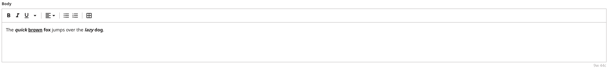

# Marked Text

Brightspot's Rich Text Editor (RTE) field is stored in HTML format which is inherently nested. This can make it difficult for clients to parse and use the response data efficiently.

Marked Text is a JSON representation of a Brightspot RTE field. It contains all the metadata for rich-text objects and is structured to account for nested tags, represented cleanly without prior knowledge of the entire state. This makes it well-suited to the GraphQL ecosystem, and allows for maintaining the integrity of its type system.

While Marked Text's data structure is advantageous, it requires handling to render to any front-end and customize with great flexibility. Brightspot developed the Marked Text Library as a solution for handling and rendering Marked Text, along with the ability to customize its appearance and functionality.

## What you will learn

1. [Query for a MarkedText](#1-query-for-markedtext) object via GraphQL.
2. Render with Brightspot's [MarkedText library](#2-render-with-brightspots-marked-text-library).

## Running the example application

> **_Note_** Just starting? Refer to the [README](/README.md) at the root of the `react-examples` repository for details on running example applications in depth.

### Install dependencies

Run the following command from the `marked-text/app` directory:

```sh
$ yarn
```

```
[1/4] 🔍 Resolving packages...
[2/4] 🚚 Fetching packages...
[3/4] 🔗 Linking dependencies...
[4/4] 🔨 Building fresh packages...
✨ Done in 5.03s.
```

## Using the example application

Publish an Article. Once published, the front end will render this article.

## How everything works

#### 1. Query for MarkedText:

[Article.tsx](app/src/components/Article.tsx). This file contains the front-end logic to focus on in this example.

- [ArticleMarkQuery](app/src/components/Article.tsx#L17) This variable holds the query made to return the article. The body contains the text and marks which forms the Marked Text object based on the view model:

```
const ArticleMarkQuery = `
  query ArticleMarkedTextQuery {
  Article {
    headline
    body {
      text
      marks {
        start
        end
        descendants
        data {
          ... on RteHtmlElement {
            __typename
            name
          }
        }
      }
    }
  }
}
`
```

#### 2. Render with Brightspot's Marked Text Library:

A look at the following rich text editor field:

| Rich Text Editor Field                                                   |
| ------------------------------------------------------------------------ |
|  |

Produces the following Marked Text object from the body of the API response:

```json
{
  "data": {
    "Article": {
      "headline": "Marked Text: Intro",
      "body": {
        "text": "The quick brown fox jumps over the lazy dog.",
        "marks": [
          {
            "start": 0,
            "end": 19,
            "descendants": 3,
            "data": {
              "__typename": "RteHtmlElement",
              "name": "p"
            }
          },
          {
            "start": 4,
            "end": 19,
            "descendants": 2,
            "data": {
              "__typename": "RteHtmlElement",
              "name": "b"
            }
          },
          {
            "start": 4,
            "end": 9,
            "descendants": 0,
            "data": {
              "__typename": "RteHtmlElement",
              "name": "i"
            }
          },
          {
            "start": 10,
            "end": 15,
            "descendants": 0,
            "data": {
              "__typename": "RteHtmlElement",
              "name": "u"
            }
          },
          {
            "start": 19,
            "end": 44,
            "descendants": 2,
            "data": {
              "__typename": "RteHtmlElement",
              "name": "p"
            }
          },
          {
            "start": 35,
            "end": 43,
            "descendants": 1,
            "data": {
              "__typename": "RteHtmlElement",
              "name": "b"
            }
          },
          {
            "start": 35,
            "end": 39,
            "descendants": 0,
            "data": {
              "__typename": "RteHtmlElement",
              "name": "i"
            }
          }
        ]
      }
    }
  }
}
```

Brightspot provides a function that makes it easy to render the Marked Text data structure.

The library `@brightspot/marked-text` serves the function `markedTextTraversal`.

- The function `markedTextTraversal` accepts a Marked Text object and a Visitor object as input. The visitor object is used during a [post order](https://www.geeksforgeeks.org/iterative-postorder-traversal) tree traversal algorithm on the Marked Text object, and invokes the visitor's callback methods to transform the nodes of the tree. It returns an array of transformed root nodes based on the visitor's implementation.

- [Article](app/src/components/Article.tsx#L73) This component makes a call to the endpoint to return the article. The return is passing the body of the Article (MarkedText) as well as the Visitor object to the `markedTextTraversal` function import from the Brightspot Marked Text library.

```js
markedTextTraversal(article?.articleData?.body, {
  visitText: (text) => <Fragment key={key++}>{text}</Fragment>,
  visitMark: (mark, children: ReactNode[]) => {
    const element = mark.data as RteHtmlElement

    return React.createElement(
      element.name,
      { key: `k-${key++}` },
      children
    )
  },
})
```

Output:

```
<p>The <b><i>quick</i> <u>brown</u> fox </b>jumps over the <b><i>lazy</i> dog</b>.</p>
```

Additionally, by providing a unified and customizable interface for traversing and transforming Marked Text, this function can simplify the integration of Marked Text with React or any other front-end library or framework.

## Troubleshooting

Refer to the [Common Issues](/README.md) section in the respository README for assistance.
