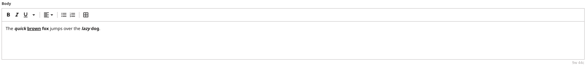

# Marked Text

The contents of a rich-text editor (RTE) field is stored in HTML format. HTML's nested structure can be difficult for clients to efficiently parse and use. To better accommodate processing of the RTE field, Brightspot provides the `MarkedText` class, a JSON representation of the RTE field. `MarkedText` contains all the metadata for rich-text objects, and cleanly represents an RTE field without prior knowledge of the field's state. This makes `MarkedText` well-suited for the GraphQL ecosystem.

In addition, Brightspot developed the Marked Text Library to conveniently query for, parse, and render `MarkedText`.

## What you will learn

* [Query for a MarkedText](#step-1-query-for-markedtext) object via GraphQL.
* Render the response with Brightspot's [MarkedText library](#step-2-rendering-rich-text-with-the-marked-text-library).

## Running the example application

**Note** Just starting? Refer to the [README](/README.md) at the root of the `react-examples` repository for details on running example applications.

### Install dependencies

Run the following command from the `marked-text/app/` directory:

```sh
yarn
```

Wait until a message similar to `✨ Done in 5.03s` appears.

## Using the example application

Before performing the following steps, publish an Article.

## How everything works

### Step 1. Query for MarkedText

Inspect the file [Article.tsx](app/src/components/Article.tsx). This file contains the front-end logic described in this example. In particular, the constant [ArticleMarkQuery](app/src/components/Article.tsx#L17) holds the query for retrieving the article. The key `body` contains the text and marks which form the `MarkedText` object based on the view model.

```gql
const ArticleMarkQuery = `
  query ArticleMarkedTextQuery {
  Article {
    headline
    body {
      text
      marks {
        start
        end
        descendants
        data {
          ... on RteHtmlElement {
            __typename
            name
          }
        }
      }
    }
  }
}
`
```



Referring to the previous image, the retrieved `MarkedText` representation is as follows:

```json
{
  "data": {
    "Article": {
      "headline": "Marked Text: Intro",
      "body": {
        "text": "The quick brown fox jumps over the lazy dog.",
        "marks": [
          {
            "start": 0,
            "end": 19,
            "descendants": 3,
            "data": {
              "__typename": "RteHtmlElement",
              "name": "p"
            }
          },
          {
            "start": 4,
            "end": 19,
            "descendants": 2,
            "data": {
              "__typename": "RteHtmlElement",
              "name": "b"
            }
          },
          {
            "start": 4,
            "end": 9,
            "descendants": 0,
            "data": {
              "__typename": "RteHtmlElement",
              "name": "i"
            }
          },
          {
            "start": 10,
            "end": 15,
            "descendants": 0,
            "data": {
              "__typename": "RteHtmlElement",
              "name": "u"
            }
          },
          {
            "start": 19,
            "end": 44,
            "descendants": 2,
            "data": {
              "__typename": "RteHtmlElement",
              "name": "p"
            }
          },
          {
            "start": 35,
            "end": 43,
            "descendants": 1,
            "data": {
              "__typename": "RteHtmlElement",
              "name": "b"
            }
          },
          {
            "start": 35,
            "end": 39,
            "descendants": 0,
            "data": {
              "__typename": "RteHtmlElement",
              "name": "i"
            }
          }
        ]
      }
    }
  }
}
```

### Step 2. Rendering rich text with the Marked Text Library

The library `@brightspot/marked-text` serves the function `markedTextTraversal`. This function renders the `MarkedText` data structure, and takes the following arguments:

- A `MarkedText` object returned from the GraphQL API. This is the body of the Article in this example.
- A `Visitor` object which contains two properties, `visitText` and `visitMark`, whose values are callback functions. These callback functions are used to transform the `MarkedText` into the implentor's desired output.

`markedTextTraversal` first converts the original `MarkedText` structure into a tree structure, similar to the [DOM](https://developer.mozilla.org/en-US/docs/Web/API/Document_Object_Model/Introduction). Next, the function traverses this newly created tree using a [post-order traversal](https://www.geeksforgeeks.org/iterative-postorder-traversal). The traversal starts from the most deeply nested node in the tree, moving upwards and outwards. This implies the innermost elements are processed first, followed by the subsequent parent nodes.

The `visitText` callback is triggered when the traversal reaches a block of text (which is always a leaf node). The text is passed as a string argument to the function, allowing the implementor to optionally transform it and return a different value.

The `visitMark` callback is triggered when the traversal process encounters a `Mark`. It has access to the current `Mark` and a `children` array. This array holds all the `text` and `Mark` nodes that have been visited and transformed by the traversal so far.

**Note**: The value returned from both `visitText` and `visitMark` will be an item in the `children` array of its respective parent node.

The constant `fetchArticleData` defines a call to the endpoint to retrieve the published Article. The return passes `MarkedText` (the Article body) and `Visitor` objects to the `markedTextTraversal` function imported from the Brightspot Marked Text library.

In this example, during the traversal, the `visitText` callback converts the string into a [React Fragment](https://react.dev/reference/react/Fragment) and returns it. This conversion makes it simple to then use the [React createElement](https://react.dev/reference/react/createElement) API to pass this value as a child in the `children` array.

When arriving at `visitMark`, the callback function takes the `mark.data` property and uses type assertion to treat this property as an `RteHtmlElement`.

_Example of a single mark_

```json
...
{
  "start": 4,
  "end": 19,
  "descendants": 2,
  "data": {
    "__typename": "RteHtmlElement",
    "name": "b"
  },
...
```

It then uses `React.createElement` to return a React element using the `name` property for the element name, assigns a key, and passes its `children`, an array of previously transformed `ReactNode`s.

```js
markedTextTraversal(article?.articleData?.body, {
  visitText: (text) => <Fragment key={key++}>{text}</Fragment>,
  visitMark: (mark, children: ReactNode[]) => {
    const element = mark.data as RteHtmlElement

    return React.createElement(
      element.name,
      { key: `k-${key++}` },
      children
    )
  },
})
```

Example Output:

```html
<p>The <b><i>quick</i> <u>brown</u> fox </b>jumps over the <b><i>lazy</i> dog</b>.</p>
```

Additionally, by providing a unified and customizable interface for traversing and transforming `MarkedText`, the `markedTextTraversal` function can simplify the integration of `MarkedText` with React or any other front-end library or framework.

## Troubleshooting

Refer to the [Common Issues](/README.md) section in the respository README for assistance.
