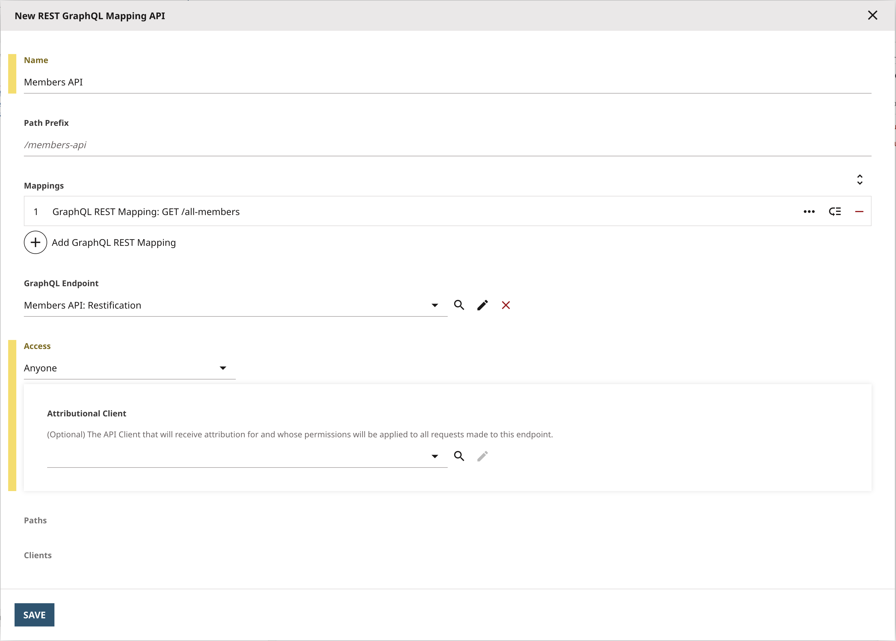
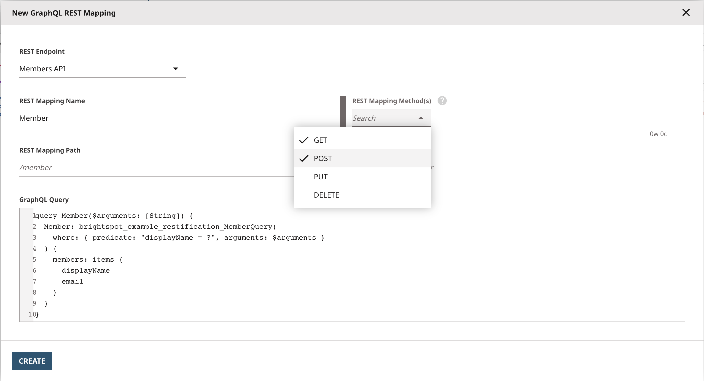

## GraphQL RESTification

Scenarios could arise where the consumer of Brightspot's API is not inherently equipped to handle GraphQL and prefer a RESTful API. Perhaps they have specific data requirements for the API and they want a custom API with specific keys/fields.

GraphQL Restification involves converting a GraphQL API into a RESTful API. This means replacing a single GraphQL endpoint with multiple RESTful endpoints. Restification grants the benefit of controlling the structure of the data, allowing the JSON response to be easily configured, choosing what fields to return using GraphQL's native query fields.

This example demonstrates how to set up GraphQL queries into individual REST API endpoints in Brightspot.

## What you will learn

1. [Use Brightspot to create REST Mapping API endpoints](#1-create-rest-mapping-api-endpoints).

## Running the example application

> **_Note_** Just starting? Refer to the [README](/README.md) at the root of the `react-examples` repository for details on running example applications in depth.

### Install dependencies

Run the following command from the `restification/app` directory:

```sh
$ yarn
```

```
[1/4] 🔍 Resolving packages...
[2/4] 🚚 Fetching packages...
[3/4] 🔗 Linking dependencies...a
[4/4] 🔨 Building fresh packages...
✨ Done in 6.03s.
```

```
$ yarn start
```

```
Compiled successfully!
```

The front-end application will not function correctly until the steps are completed.

## Step 1: Building the Query and Create REST Mapping

In Brightspot from the menu **&#x2630;**, navigate to **Developer** &rarr; **GraphQL Explorer** and select **Members API: Restification** from the **Select GraphQL Endpoint** dropdown.

In this example, the query created retrieves all members, restricting the data returned to only the members' display name. One of the benefits using GraphQL to created the REST endpoings is the ability to use [GraphQL's Aliases](https://graphql.org/learn/queries/#aliases) to alter the shape of the data.

Copy and paste the followng query into the explorer:

```
query AllMembers {
  ListOfMembers: brightspot_example_restification_MemberQuery {
    members: items {
      displayName
    }
  }
}
```

`brightspot_example_restification_MemberQuery` simply becomes `ListOfMembers`, `items` becomes `members` and adds that extra layer of readability.

To test the query, click the play/execute button.

#### 1. Create REST mapping API endpoints

After testing the query, create the first REST Map, click the Cog icon in the GraphQL Explorer (located on the right hand side of the page) and select **Create REST Mapping**. The **New GraphQL REST Mapping** form pops up:

| REST Mapping Endpoint Form                                                                 |
| ------------------------------------------------------------------------------------------ |
|  |

The **REST Endpoint** is pre-selected with **Create New...** being the first REST Endpoint created.

1. Under **REST Mapping Name**, **AllMembers** will be pre-populated. This is based on the query name.
2. Under **REST Mapping Method(s)**, ensure that **GET** request is selected.
3. Under **REST Mapping Path**, the REST mapping path is automatically generated as **/all-members** from the query name.
4. Click **Create**.

As this is the first mapping, the a new form pops up to create the REST API mapping, with the title **New REST GraphQL Mapping API**

| REST Mapping API Form                                                              |
| ---------------------------------------------------------------------------------- |
|  |

1. Under **Name**, enter 'Members API'.
2. Under Access, select **Anyone**. Access by default is set to inherit based on the endpoint used and in this example
3. Click **Save**.

> - After entering the name, the **Path Prefix** section automatically generates **/members-api**
> - The **GraphQL Endpoint** section defaults to the API you are working on in the GraphQL Explorer
> - The **Paths** section at the bottom is automatically generated based on the **Path Prefix** and the **REST Mapping Name**

Repeat the process using the following query:

```
query Member($arguments: [String]) {
  Member: brightspot_example_restification_MemberQuery(
    where: { predicate: "displayName = ?", arguments: $arguments }
  ) {
    members: items {
      displayName
      email
    }
  }
}
```

At the bottom of the explorer, pull up the 'QUERY VARIABLES' section and put in the variable to test. Your variable looks similar to the following:

```json
{
  "arguments": "<Member Display Name Here>"
}
```

Test the query to confirm the results are as expected.

Create the REST Mapping for the query:

| REST Mapping Endpoint Form                                                            |
| ------------------------------------------------------------------------------------- |
|  |

The form will be automatically completed but under 'REST Mapping Method(s)'.

Repeat the process once more but copying and pasting this mutation:

```
mutation CreateMember($displayName: String = "", $firstName: String = "", $lastName: String = "", $email: String = "", $phoneNumber: Float = 1.5) {
  brightspot_example_restification_MemberSave(
    diffs: {brightspot_example_restification_MemberDiff: {
      displayName: $displayName,
      firstName: $firstName,
      lastName: $lastName,
      email: $email,
      phoneNumber: $phoneNumber
    }
    }) {
    displayName
    firstName
    lastName
    email
    phoneNumber
  }
}
```

This mutation will become a POST request to create a new member. As it's a mutation, the **REST Mapping Method** has selected POST automatically:

SCREENSHOT

1. Test the GET endpoint by visiting '[http://localhost/members-api/all-members](http://localhost/members-api/all-members)' into your browser.
2. Test the second REST mapping endpoint with a GET request made with the display name as the parameter by visiting 'http://localhost/members-api/member?arguments=Member_Display_Name_Here' in your browser.

## Step 3 Run the React App

Test the endpoint using the included React App.

From the 'app' directory in the terminal, run:

```sh
yarn start
```

Navigate to `http://localhost:3000/` in the web browser and see the text from the published content.

Type in the display name created earlier for the GET with params and POST request.

## Try it yourself

## Troubleshooting

If your REST endpoint is displaying 'INVALID CREDENTIALS'. Be sure that your REST Mapping's **Access** is changed to **Anyone** rather than **inherit**.

Having issues running the example application? Refer to the [Common Issues](/README.md) section in the repository README for assistance.
