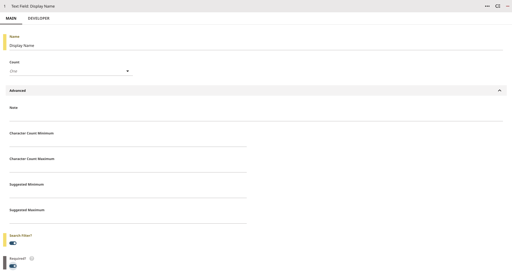
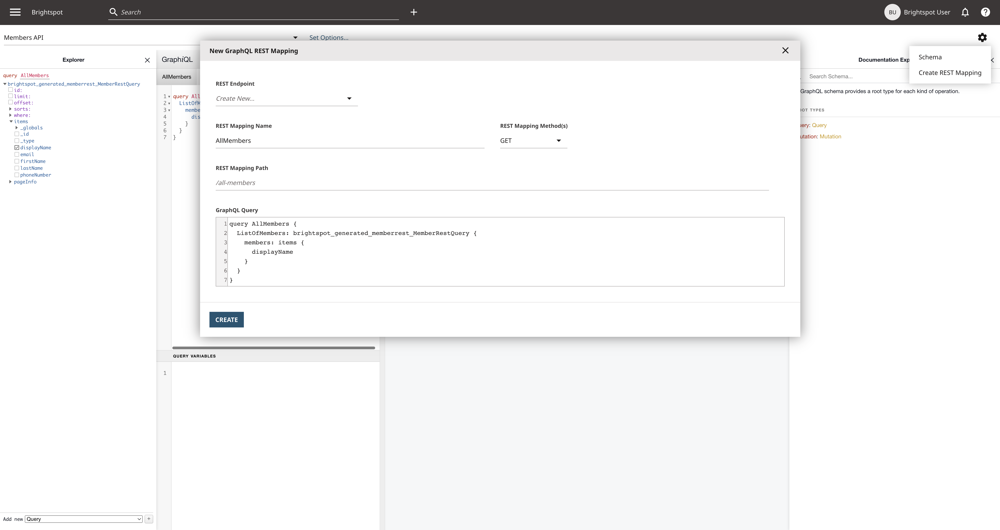
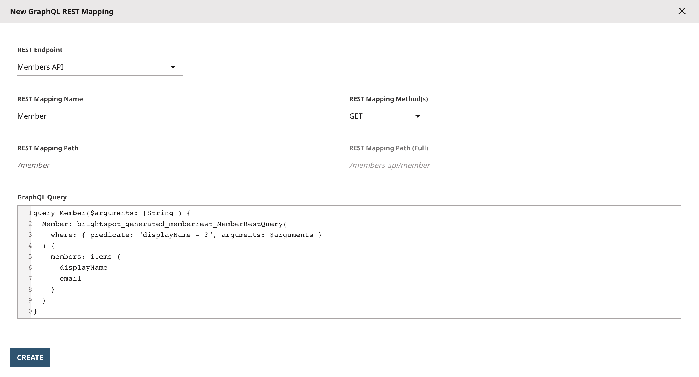

## GraphQL RESTification

Scenarios could arise where the consumer of Brightspot's API is not inherently equipped to handle GraphQL and prefer a RESTful API. Perhaps they have specific data requirements for the API and they want a custom API with specific keys/fields.

GraphQL Restification involves converting a GraphQL API into a RESTful API. This means replacing a single GraphQL endpoint with multiple RESTful endpoints. Restification grants the benefit of controlling the structure of the data, allowing the JSON response to be easily configured, choosing what fields to return using GraphQL's native query fields.

This example demonstrates how to set up GraphQL queries into individual REST API endpoints in Brightspot.

## What you will learn

1. [Use Brightspot to create REST Mapping API endpoints](#1-create-rest-mapping-api-endpoints).

## Running the example application

> **_Note_** Just starting? Refer to the [README](/README.md) at the root of the `react-examples` repository for details on running example applications in depth.

### Install dependencies

Run the following command from the `restification/app` directory:

```sh
$ yarn
```

```
[1/4] 🔍 Resolving packages...
[2/4] 🚚 Fetching packages...
[3/4] 🔗 Linking dependencies...a
[4/4] 🔨 Building fresh packages...
✨ Done in 6.03s.
```

```
$ yarn start
```

```
Compiled successfully!
```

The front-end application will not function correctly until the steps are completed.

## Step 1: Create Content Member (REST) Content Type

In Brightspot from the navigation menu **&#x2630;**, under **Admin**, select **Content Types**.

Under the **New Content Type** form, for **Name**, enter **Member (REST)** as the content type name. Under **Items**, select the dropdown field, For the first field select **Text Field**. In the text field form, for name, enter **Display Name** and scroll down to the bottom of the form and toggle **Search Filter?** and **Required** on:

| Text Field: Display Name                                                                     |
| -------------------------------------------------------------------------------------------- |
|  |

Add three more text fields, one for **First Name**, **Last Name** and **Email**. Lastly add a **Number Field** with the name **Phone Number**

Then click the **SAVE** button at the very bottom.

| Member (REST) Content Type                                                                     |
| ---------------------------------------------------------------------------------------------- |
|  |

## Step 2: Create Content Management API (CMA) Endpoint

With the content type created, using the navigation menu **&#x2630;**, under **Admin**, select **APIs**. On the left pane, under **Create**, use the drop down to select **GraphQL Content Management API** and click **New** to be presented with the form to create the API.

In the form, for **Name** enter **Members API**. Under **Read Types** and **Read/Write Types**, using the drop down menu select **Member (REST)**.

Click Save.

| Members API (CMA) Endpoint                                                             |
| -------------------------------------------------------------------------------------- |
|  |

## Step 3: Building the Query and Create REST Mappings

From the navigation menu **&#x2630;**, go to **Developer** &rarr; **GraphQL Explorer** and select **Members API** from the **Select GraphQL Endpoint** dropdown.

In this example, the query created retrieves all members, restricting the data returned to only the members' display name. One of the benefits using GraphQL to created the REST endpoings is the ability to use [GraphQL's Aliases](https://graphql.org/learn/queries/#aliases) to alter the shape of the data.

Copy and paste the followng query into the explorer:

```
query AllMembers {
  ListOfMembers: brightspot_generated_memberrest_MemberRestQuery {
    members: items {
      displayName
    }
  }
}
```

`brightspot_generated_memberrest_MemberRestQuery` simply becomes `ListOfMembers`, `items` becomes `members` and adds that extra layer of readability.

To test the query, click the play/execute button.

#### 1. Create REST mapping API endpoints

After testing the query, create the first REST Map, click the Cog icon in the GraphQL Explorer (located on the right hand side of the page) and select **Create REST Mapping**. The **New GraphQL REST Mapping** form pops up:

| GraphQL Explorer with REST Mapping Endpoint Form                                           |
| ------------------------------------------------------------------------------------------ |
|  |

The **REST Endpoint** is pre-selected with **Create New...** being the first REST Endpoint created.

1. Under **REST Mapping Name**, **AllMembers** will be pre-populated. This is based on the query name.
2. Under **REST Mapping Method(s)**, ensure that **GET** request is selected.
3. Under **REST Mapping Path**, the REST mapping path is automatically generated as **/all-members** from the query name.
4. Click **Create**.

As this is the first mapping, the a new form pops up to create the REST API mapping, with the title **New REST GraphQL Mapping API**

| REST GraphQL Mapping API Form                                                             |
| ----------------------------------------------------------------------------------------- |
|  |

1. Under **Name**, enter 'Members API'.
2. Under Access, select **Anyone**. Access by default is set to inherit based on the endpoint used and in this example
3. Click **Save**.

> - After entering the name, the **Path Prefix** section automatically generates **/members-api**
> - The **GraphQL Endpoint** section defaults to the API you are working on in the GraphQL Explorer
> - The **Paths** section at the bottom is automatically generated based on the **Path Prefix** and the **REST Mapping Name**

Repeat the process using the following query:

```
query Member($arguments: [String]) {
  Member: brightspot_generated_memberrest_MemberRestQuery(
    where: { predicate: "displayName = ?", arguments: $arguments }
  ) {
    members: items {
      displayName
      email
    }
  }
}
```

At the bottom of the explorer, pull up the 'QUERY VARIABLES' section and put in the variable to test. Your variable looks similar to the following:

```json
{
  "arguments": "<Member Display Name Here>"
}
```

Test the query to confirm the results are as expected.

Create the REST Mapping for the query:

| REST Mapping Endpoint Form: GET Member                                                       |
| -------------------------------------------------------------------------------------------- |
|  |

The form will be automatically completed but under 'REST Mapping Method(s)'.

Repeat the process once more, this time copying and pasting this mutation:

```
mutation CreateMember($displayName: String = "", $firstName: String = "", $lastName: String = "", $email: String = "", $phoneNumber: Float = 1.5) {
  brightspot_generated_memberrest_MemberRestSave(
    diffs: {brightspot_generated_memberrest_MemberRestDiff: {
      displayName: $displayName,
      firstName: $firstName,
      lastName: $lastName,
      email: $email,
      phoneNumber: $phoneNumber
    }
    }) {
    displayName
    firstName
    lastName
    email
    phoneNumber
  }
}
```

This mutation will become a POST request to create a new member. As it's a mutation, the **REST Mapping Method** selects POST automatically:

| REST Mapping Endpoint Form: Create Member                                           |
| ----------------------------------------------------------------------------------- |
|  |

## Step 4: Testing the REST Endpoints

1. Test the GET endpoint by visiting [http://localhost/members-api/all-members](http://localhost/members-api/all-members) into your browser.
2. Test the second REST mapping endpoint with a GET request made with the display name as the parameter by visiting 'http://localhost/members-api/member?arguments=Member_Display_Name_Here' in your browser.
3. Test the POST request from the command line using cURL, copy and paste the following:

   ```
   curl --location --request POST 'http://localhost/members-api/create-member' \
   --form 'displayName="TestUser"' \
   --form 'firstName="TestFirstName"' \
   --form 'lastName="TestSurname"' \
   --form 'email="test@test.com"' \
   --form 'phoneNumber="1112223333"'
   ```

   Output:

   ```
   {"data":{"brightspot_example_restification_MemberSave":{"displayName":"TestUser","firstName":"TestFirstName","lastName":"TestSurname","email":"test@test.com","phoneNumber":1.112223333E9}}}
   ```

You will now see that user is added by either navigating to Brightspot and see that **Member (REST)** content with the data just sent has been created or by navigating to [http://localhost/members-api/all-members](http://localhost/members-api/all-members) and see the object: ` {"displayName":"TestUser"}` has been added to the array of members.

## Try it yourself

## Troubleshooting

If your REST endpoint is displaying 'INVALID CREDENTIALS'. Be sure that your REST Mapping's **Access** is changed to **Anyone** rather than **inherit**.

Having issues running the example application? Refer to the [Common Issues](/README.md) section in the repository README for assistance.
