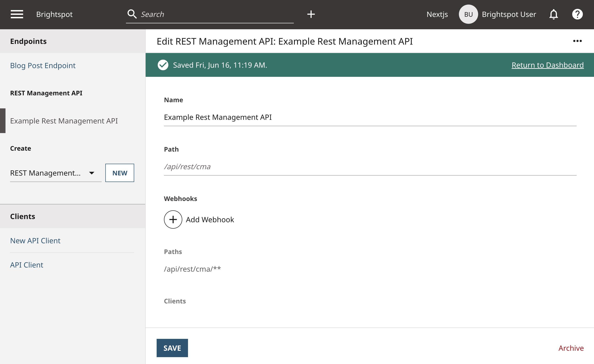

# Static Site Generation with Webhooks

Static web pages are faster and lighter than dynamic pages, resulting in better performance and shorter load times. They are typically used for content that rarely changes, because updating static pages requires lengthy rebuilds of the entire site. However, newer front-end frameworks allow for on-demand updates to individual pages, providing fast and up-to-date pages without the limitation of frequent site rebuilds.

This example demonstrates how to leverage Brightspot's notification and webhooks features to trigger web page regeneration when content is published or updated.

## What you will learn

1. [Create a notification payload and topic](#step-1-create-a-notification-payload-and-topic)
1. [Create a notification trigger](#step-2-create-a-notification-trigger)
1. [Configure the REST Management API](#step-3-configure-the-rest-management-api)
1. [Create a webhook](#step-4-create-a-webhook)
1. [Create a Next.js webhook handler](#step-5-create-a-nextjs-webhook-handler)
1. [Create view models to get URL paths and data fields](#step-6-create-view-models-to-get-url-paths-and-data-fields)
1. [Create static Next.js pages](#step-7-create-static-nextjs-pages)
1. [Handle permalink updates and deletions](#step-8-handle-permalink-updates-and-deletions)

## Running the example application

**Note** Just starting? Refer to the [README](/README.md) at the root of the `react-examples` repository for details on running example applications.

<details>
<summary>
<span>
<b>Configure a REST Management API</b>
</span>
</summary>

1. In Brightspot, navigate to **☰ > Admin > API > Create > REST Management API > New**.
1. In the **Name** field, enter a name.
1. Click **Save**.


</details>

<details>
<summary>
<span>
<b>Create an API Client</b>
</span>
</summary>

1. In Brightspot, navigate to **☰ > Admin > APIs > Clients > New API Client**.
1. In the **Name** field, enter a name.
1. Under **Endpoints**, click &#x2295; and select the REST Management API you created. 
1. Under **Keys**, click &#x2295; and enter an API key. 
1. Copy the **Client ID** and the API key to the matching variables in the `app/.env` file.
1. Click **Save**.

</details>

<details>
<summary>
<span>
<b>Create a Site</b>
</span>
</summary>

1. In Brightspot, navigate to **☰ > Admin > Sites & Settings > New Site**.
1. In the **Name** field, enter a name.
1. Under **URLs**, add `http://localhost:3000`.
1. Click **Save**.

</details>


<details>
<summary>
<span>
<b>Configure the server</b>
</span>
</summary>

### Install dependencies

```sh
yarn
```
Wait until a message similar to `✨ Done in 5.03s` appears.

### Generate types
</span>
</summary>

```sh
yarn codegen
```
Wait until a message similar to `✨ Done in 2.13s` appears.


### Create a webhook

```sh
yarn webhook
```

Wait until a message similar to `✨ Done in 0.45s` appears.

### Generate Next.js app production build

```sh
yarn build
```
Wait until a message similar to `✨ Done in 3.29s` appears.

### Start the Next.js app production server

```sh
yarn start
```

Wait until a message `ready - started server on 0.0.0.0:3000, url: http://localhost:3000` appears.

</details>

## Using the example application

The Next.js app is a simple blog site consisting of blog posts. The blot poses are defined to automatically generate permalinks as shown in the [Brightspot Routing](../brightspot-routing) example.

Within Brightspot, publish one or more blog posts. After a few seconds, refresh the Next.js web page, and navigate through the app to find the published posts. The posts appear on the app without needing to rebuild.

### Step 1. Create a notification payload and topic

In this context, a payload is the data structure that is sent from Brightspot to the front-end app. The app needs to know which pages to regenerate, so the payload should include a list of unique identifiers for those pages.

A payload is created by extending the `JavaRecord` class and adding fields that represent the desired data structure.

This example uses a data structure that mirrors the [Brightspot Routing](../brightspot-routing) example. The payload includes a `paths` field for storing a list of URL paths and associated metadata of new or updated blog posts.

The following example is in the file [BlogPostPayload.ts](./brightspot/src/brightspot/example/ssg_with_webhooks/notification/BlogPostPayload.ts).

```ts
export default class BlogPostPayload extends JavaClass(
  'brightspot.example.ssg_with_webhooks.notification.BlogPostPayload',
  JavaRecord
) {
  @JavaField(List.Of(BlogPostPayloadPath))
  paths?: List<BlogPostPayloadPath>
}
```

The `paths` field is defined as a list of `BlogPostPayloadPath`, which is defined in the file [BlogPostPayloadPath.ts](./brightspot/src/brightspot/example/ssg_with_webhooks/notification/BlogPostPayloadPath.ts).

```ts
@Embedded
export default class BlogPostPayloadPath extends JavaClass(
  'brightspot.example.ssg_with_webhooks.notification.BlogPostPayloadPath',
  JavaRecord
) {
  @JavaField(String)
  path?: string

  @JavaField(List.Of(String))
  siteUrls?: List<string>

  @JavaField(String)
  type?: string
}
```
 
 Instances of this class package the URL path metadata together with the path itself. The `@Embedded` annotation is added so that the values of the subfields are added to the payload.


A topic bundles the payload together and then delivers it. The topic is a class that extends the `AbstractTopic<P>` abstract class, where `P` is the payload class. Topics can optionally store additional configuration fields.

The example in the file [BlogPostTopic.ts](./brightspot/src/brightspot/example/ssg_with_webhooks/notification/BlogPostTopic.ts) does not use any configuration fields, and only overrides the `toStringFormat()` method for debugging purposes.

```ts
export default class BlogPostTopic extends JavaClass(
  'brightspot.example.ssg_with_webhooks.notification.BlogPostTopic',
  AbstractTopic.Of(BlogPostPayload)
) {
  toStringFormat(subscriber: Subscriber, payload: BlogPostPayload): string {
    return payload.getLabel()
  }
}
```

### Step 2. Create a notification trigger

To be kept current at all times, the front-end app should receive a notification every time a blog post is created or updated. One way to capture these events is by overriding the `afterSave()` method, as this method is called every time an asset is created or updated.

This example, foun d in [BlogPostTrigger.ts](./brightspot/src/brightspot/example/ssg_with_webhooks/notification/BlogPostTrigger.ts), separates the notification trigger from the data model by using a [Modification](https://www.brightspot.com/documentation/brightspot-cms-developer-guide/latest/modifications) of the `BlogPost` model. Within the overridden `afterSave()` method, the following occurs:

* The payload is created.
* The `paths` field is populated with the blog post's URL path data.
* A notification is published using the matching topic and the newly instantiated payload.

```ts
export default class BlogPostTrigger extends JavaClass(
  'brightspot.example.ssg_with_webhooks.notification.BlogPostTrigger',
  Modification.Of(BlogPost)
) {
  afterSave(): void {
    super.afterSave()

    let BlogPostPayload = ClassFinder.getClass(
      'brightspot.example.ssg_with_webhooks.notification.BlogPostPayload'
    )

    // Creates a new payload
    let payload = new BlogPostPayload() as BlogPostPayload

    // Gets the raw URL path data for this published content
    let paths = this.getAllPaths()

    // Converts the raw URL path objects into strings and stores them on the payload's path field
    payload.paths = this.convertPathsToPayloadPaths(paths)

    // Publishes a notification with the blog post topic and payload attached
    Notification.publish(BlogPostTopic.getClass() as Class<Topic<any>>, payload)
  }

  /***
   * Helper method that returns the URL path data for this published content
   ***/
  getAllPaths(): JavaSet<Path> {
    return this.as(DirectoryData.class).getPaths()
  }

  /***
   * Helper method that takes raw URL path data and converts it into strings to
   * match the BlogPostPayloadPath fields.
   ***/
  convertPathsToPayloadPaths(paths: JavaSet<Path>): List<BlogPostPayloadPath> {
    // ... implementation
  }
}
```

### Step 3. Configure the REST Management API

[Step 2](#step-2-create-a-notification-trigger) determines when notifications are sent, but not their delivery method. This step configures the REST Management API, and allows developers to create webhooks that point to their front-end app.

To configure the REST Management API in Brightspot, do the following:

1. Navigate to **☰ > Admin > APIs > Create > REST Management API > New**.
1. In the **Name** field, enter a name.
1. In the **Path** field, enter a path.
1. Click **Save**.




### Step 4. Create a webhook

A webhook can be created through the Brightspot UI or through an external HTTP request. This example in [createWebhook.mjs](./app/createWebhook.mjs) uses a Node.js script to create a webhook. It also uses the [Fetch API](https://developer.mozilla.org/en-US/docs/Web/API/Fetch_API/Using_Fetch) to send an HTTP request to the `/webhooks` route of the REST Management API with a body containing the webhook configuration. The configuration includes the desired notification topic (defined in [Step 1](#step-1-create-a-notification-payload-and-topic)) and a recipient URL.

```js
const postWebhook = async () => {
  fetch(`${process.env.REST_MANAGEMENT_ENDPOINT}/webhooks`, {
    method: 'POST',
    headers: {
      'X-Client-Id': process.env.CLIENT_ID,
      'X-Client-Secret': process.env.CLIENT_API_KEY,
    },
    body: JSON.stringify(body),
  })
    .then((res) => res.json())
    .then((res) => console.log(res))
}

postWebhook()
```

The body of the request must be structured as the code example below. `url` is the full recipient URL for the webhook, and the `topic._type` is the full class name of the webhook topic defined in [Step 1](#step-1-create-a-notification-payload-and-topic).

```js
const body = {
  url: process.env.NEXTJS_WEBHOOK_ROUTE,
  topic: {
    _type: 'brightspot.example.ssg_with_webhooks.notification.BlogPostTopic',
  },
}
```

**Note** The script is mapped to the `yarn webhook` command defined in `package.json`. In this example, the command should only be run once. Separate scripts could be used to create, modify, or delete webhooks.

### Step 5. Create a Next.js webhook handler

This example in the file [revalidate.ts](./app/pages/api/revalidate.ts) uses Next.js [API Routes](https://nextjs.org/docs/pages/building-your-application/routing/api-routes) and [On-Demand Revalidation](https://nextjs.org/docs/pages/building-your-application/data-fetching/incremental-static-regeneration#on-demand-revalidation) to handle the webhooks coming from Brightspot. The Next.js webhook handler API route must match the URL destination defined in [Step 4](#step-4-create-a-webhook). This example uses `pages/api/revalidate`.

The body of the incoming webhook is structured as the webhook payload defined in [Step 1](#step-1-create-a-notification-payload-and-topic). The list of URL path data is extracted from the request, and the corresponding Next.js app pages are revalidated.


```ts
// data structure matches the payload defined in step 1
type Path = {
  path: string
  siteUrls?: string[]
  type: string
  _id: string
  _type: string
}

export default async function handler(
  req: NextApiRequest,
  res: NextApiResponse
) {
  // extract URL path data from incoming webhook
  let paths: Path[] = req.body.data.paths || []

  // filter out paths that belong to other Sites
  paths = paths.filter((path) =>
    path.siteUrls?.some(
      (siteUrl) => siteUrl === process.env.NEXT_PUBLIC_BSP_SITE_URL
    )
  )

  // revalidate each individual path
  for (const directoryPath of paths) {
    try {
      await res.revalidate(directoryPath.path)
    } catch (err) {
      console.log(err)
    }
  }

  // additionally, revalidate the 'Home' page
  if (paths.length > 0) {
    try {
      await res.revalidate('/')
    } catch (err) {
      console.log(err)
    }
  }

  return res.json({ revalidated: true })
}
```

### Step 6. Create view models to get URL paths and data fields

To build static pages, the Next.js app needs fetch all of the URL paths for relevant content, and then use those paths to get the data fields for each.

Because this example has a single data model, it uses a view model that queries for all objects of type [AllBlogPostsViewModel.ts](./brightspot/src/brightspot/example/ssg_with_webhooks/api/AllBlogPostsViewModel.ts). The Next.js app uses that view model in a GraphQL query that retrieves the relevant URL path metadata ([AllPaths.graphql](./app/queries/AllPaths.graphql)). For each individual object, the app uses the [BlogPostViewModel.ts](./brightspot/src/brightspot/example/ssg_with_webhooks/api/BlogPostViewModel.ts) and [BlogPost.graphql](./app/queries/BlogPost.graphql) query to fetch relevant data.

### Step 7. Create static Next.js pages

Because the URL paths for blog posts depend on CMS data, the corresponding Next.js page filename must use [Dynamic Routes](https://nextjs.org/docs/pages/building-your-application/routing/dynamic-routes) and [Catch-all Segments](https://nextjs.org/docs/pages/building-your-application/routing/dynamic-routes#catch-all-segments) to map out the paths, as in the following example.

```
pages/[...path.tsx]
```

Then, to define the list of page paths to be statically generated during the site build, the [getStaticPaths](https://nextjs.org/docs/pages/building-your-application/data-fetching/get-static-paths) function is defined inside the page. This function uses Apollo Client and the query defined in [Step 6](#step-6-create-view-models-to-get-url-paths-and-data-fields) to get the list of all URL paths to the relevant assets, and then returns that list. See the example in the file [[...path.tsx]](./app/pages/%5B...path%5D.tsx).

**Note** The `getStaticPaths` function in this example only adds paths with the `Permalink` type. Other path types are ignored.

```ts
export const getStaticPaths: GetStaticPaths = async () => {
  const { data } = await client.query({
    query: GetAllPathsDocument,
  })

  let paths: { params: ParsedUrlQuery }[] = []

  data.AllBlogPosts.blogPosts.forEach((blogPost: BlogPost) => {
    blogPost.paths?.forEach((path) => {
      if (path?.type === 'Permalink') {
        paths.push({ params: { path: path?.path?.split('/') } })
      }
    })
  })

  paths.forEach((path: any) => path.params.path.shift())

  return {
    paths,
    fallback: true,
  }
}
```

Next, the props for each static page are fetched using [getStaticProps](https://nextjs.org/docs/pages/building-your-application/data-fetching/get-static-props). The `context` parameter contains a field that lists the URL route segments (e.g., `[my, example, path]`). The segments are joined to form a URL path string that serves as a variable for the GraphQL query that returns matching blog posts. If the query returns an object, it passes the data as props for the Next.js page to use.

```ts
export const getStaticProps: GetStaticProps = async (context) => {
  let subdirectories = context.params?.path as string[]
  let path = subdirectories.join('/')

  const { data } = await client.query({
    query: GetBlogPostDocument,
    variables: {
      path,
    },
  })

  if (data.BlogPost) {
    return {
      props: { blogPost: data.BlogPost },
    }
  }

  return {
    notFound: true,
  }
}
```

Lastly, the page uses the props to render the component.

```ts
const Content: NextPage<Props> = ({ blogPost }) => {
  // return ...
}
```

### Step 8. Handle permalink updates and deletions

The notification trigger in [Step 2](#step-2-create-a-notification-trigger) captures the URL paths of the asset _after_ it is saved. This creates a potential problem when a permalink is updated or deleted. The resulting webhook will send the new permalink paths, not the old ones, potentially creating dead links on the front-end app—because editors may delete old permalinks.

The example in [BlogPostTrigger.ts](./brightspot/src/brightspot/example/ssg_with_webhooks/notification/BlogPostTrigger.ts) modifies the notification trigger to include the old URL paths in the payload, so the front-end app will regenerate those pages as well. First, an `oldObject` field is added to the trigger with the `@Ignored` annotation so that it does not appear on the **Blog Post** content edit page. The `oldObject` field is populated within the `beforeCommit()` method, and its value is set using the [Query API](https://www.brightspot.com/documentation/brightspot-cms-developer-guide/latest/querying). Since this happens in `beforeCommit()`, all of the object's previous values, including the URL paths, are stored for later use.


```ts
@Ignored
@JavaField(BlogPost)
oldObject?: BlogPost

beforeCommit() {
  super.beforeCommit()

  this.oldObject = Query.from(BlogPost.getClass())
    .where('_id = ?', this)
    .noCache()
    .first()
}
```

Next, the `getAllPaths()` helper method is updated to add the URL paths from the `oldObject` as well.

```ts
getAllPaths(): JavaSet<Path> {
  let paths = new ArrayList<Path>()

  paths.addAll(this.as(DirectoryData.class).getPaths())
  paths.addAll(
    this.oldObject?.as(DirectoryData.class).getPaths() ||
      new ArrayList<Path>()
  )

  return paths
}
```

## Try it yourself

The following is a suggestion for learning more about static site generation and webhooks with Brightspot:

Consider a case in which the app needs to serve 3xx status codes on redirect URLs. Try updating the `getStaticProps` function to check if the path is a permalink, and return a `Redirect` object if so.

## Troubleshooting

Refer to the [Common Issues](/README.md) section in the repository README for assistance.
