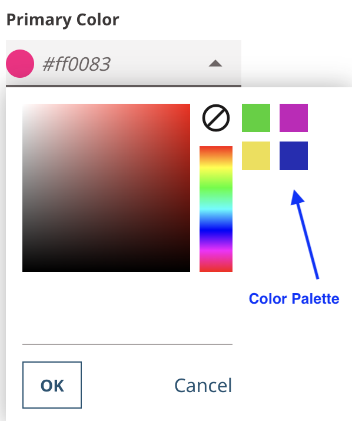

# Theming

Just like a site that's rendered by Brightspot, when building a site rendered independently, there's a need to have fields in the CMS that control stylistic or visual aspects of the final page but are decoupled from the core data model. Brightspot provides a solution with the Theme / Styleguide system. Similar capabilities have been exposed for Brightspot's [Content Delivery APIs](https://www.brightspot.com/documentation/brightspot-cms-developer-guide/cda-guides) (CDA).

This example demonstrates implementing Brightspot [theming](https://www.brightspot.com/documentation/brightspot-cms-developer-guide/latest/data-modeling-for-themes) via a CDA Endpoint to enable editorial styling and other front-end presentation changes.

## What you will learn
1. [Create a theme](#1-create-a-theme)
2. [Configure theme content styling](#2-configure-theme-content-styling)
3. [Configure theme global styling](#3-configure-theme-global-styling)
4. [Add a theme to a CDA endpoint](#4-add-a-theme-to-a-cda-endpoint).
5. [Use theme fields in a front-end application](#5-use-theme-fields-in-a-front-end-application)

## Running the example application

> **_Note_** Just starting? Refer to the [README](/README.md) at the root of the `react-examples` repository for details on running example applications in depth.

Run the following commands from the `theming/app` directory:

### Install dependencies

```sh
$ yarn
```

```
[1/4] 🔍 Resolving packages...
[2/4] 🚚 Fetching packages...
[3/4] 🔗 Linking dependencies...
[4/4] 🔨 Building fresh packages...
✨ Done in 6.03s.
```

### Start the React app

```sh
$ yarn start
```

```
Compiled successfully!
```

The React app opens automatically in the browser.

## Using the example application

The front-end application displays a title with a black font color.  

1. Generate a theme zip file:
  CD into `theming/brightspot`, and run the command `yarn run config`. A new `custom-theme.zip` file will be generated om the `theming/brightspot` directory if one does not already exist. 

2. Upload a theme to Brightspot:
  From **&#x2630;** navigate to **Admin** &rarr; **Themes** &rarr; **New Theme**. In the **MAIN** section for the New Theme, add a Name and click on the **CHOOSE** button next to the **New Upload** dropdown menu. Select the zip file created in step 1, then click the **SAVE** button. 

3. Apply Theme to your endpoint:
  Navigate from **&#x2630;** to **Admin** &rarr; **APIs**, and select **Theming Endpoint**. Select the theme you created, then click **SAVE**.  

4. Create a Site:
  It is best practice to apply a theme to a child Site and not the Global site. Navigate from **&#x2630;** to **Admin** &rarr; **Sites & Settings**, and create a New Site by selecting **New Site**. Add a name, and for the theme, select **Shared**, then the name of the theme you created. Click **SAVE**. If you look at your front-end application, you will notice nothing has changed. This is expected since you have not selected overiding styles from the theme you applied.  

5. Add theme overriding styles:
  Navigate back to the theme you created in Brightspot. There are two new tabs:  **Color Palette**, and **Overrides**. You can create a color palette to make color selection easier by selecting colors and saving those selections. If you add a color palette, those colors will appear as a palette when you click on the color pickers in the **Overrides** tab. Select colors and any other overriding styles and save. Refresh the front-end application page to see the applied overriding styles. This styling is for any site using this theme.

6. Add content overriding styles:
  In Brightspot, create a **Theming Article** by clicking **+** at the top of the page, then **Theming Article** from the dropdown menu. In the **New Theming Article** form, add a title and body. Click **⋯** (located at the top right of the content item page next to the **URLS** widget) and select **Styles**. Click the **v** to expand to the **Preset** section. Select **Custom**, and select styling from the options available. Finally, click **PUBLISH**. Refresh the front-end application page to see the Theming Article and applied styles.

## How everything works

### #1. Create a theme

  [`_config.json`](/theming/brightspot/_config.json): This file provides the core information for a theme. A theme config file may consist of the following fields:
  - `themeFields`: Fields for global theme styling
  - `colorPalette`: Fields to create a color palette for easier color selection
  - `styles`: Fields for content styling

  ```json
  {
    "themeFields": {},
    "styles": {},
    "colorPalette": {}
  }
  ```

  Brightspot accepts theme files as zip files. In this example, the theme zip file is generated by running the script `yarn run config`, which executes the [`config.sh`](/theming/brightspot/config.sh) file. 

### #2. Configure theme content styling

[`@ViewTemplate`](/theming/brightspot/src/brightspot/example/theming/ThemeArticleViewModel.ts): View interfaces with this annotation will have a string field, `_viewTemplate`, added to their object type that will return the value of the annotation. 


View Model:
```typescript
@ViewInterface
@ViewTemplate({ value: '/themingArticle' })
export default class ThemingArticleViewModel extends JavaClass(
  'brightspot.example.theming.ThemingArticleViewModel',
  ViewModel.Of(ThemingArticle),
```

Theme configuration:
```yaml
 "styles": {
    "/themingArticle": {  // same name as @ViewTemplate value
      "fields": {
```

> **_Note_** The template name must have a preceeding forward slash. Ex: `@ViewTemplate({ value: "/themingArticle" })`.

[`fields`](/theming/brightspot/_config.json): Theme styling for content types added to this field for each content type.

```json5
 "fields": {
        "alignment": {
          "type": "text",  // type of field
          "displayName": "Title alignment", // name displayed in Brightspot UI
          "cms.ui.note": "Select preferred alignment.", // any additional notes
          "cms.ui.dropDown": true, // dropdown option
          "values": [ //dropdown values
            {
              "label": "Left",
              "value": "left"
            },
            {
              "label": "Middle",
              "value": "middle"
            },
            {
              "label": "right",
              "value": "right"
            }
          ]
        },
```

Fields used in this example: `boolean`, `text`, `number`, and `color`. 

### #3. Configure theme global styling

[`themeFields`](/theming/brightspot/_config.json): Theme global styling fields are added to this field.

Theme configuration:

```json
 "themeFields": {
    "primaryColor": {
      "displayName": "Primary Color",
      "type": "color",
      "cms.ui.placeholder": "#ff0083"
    },
```

[`colorPalette`](/theming/brightspot/_config.json): This field enables setting color palette colors that can be used in any `color` theme UI field in Brightspot.

```json
  "colorPalette": {
    "colorOne": {
      "displayName": "Color 1",
      "type": "color"
    },

```

If `colorPalette` is set in the theme, this tab will after uploading a theme. 


Example color palette:

| Color Palette                                            |
| -------------------------------------------------------- |
|  |


### 4. Add a theme to a CDA Endpoint

- [`ThemingEndpoint.ts`](/theming/brightspot/src/brightspot/example/theming/ThemingEndpoint.ts): Implement the `ContentDeliveryApiThemeable` interface to enable applying a theme to a CDA endpoint. Make sure the theme is applied to the site in use.


### 5. Use theme fields in a front-end application

When a theme is applied to an endpoint, and also to the site, the endpoint will expose a `_Theme` root field. Each content item with a `@ViewTemplate` annotation applied will also have `_style` and `_viewTemplate` fields:

```graphql
 query MyQuery {
  _Theme {
    bodyFont
    buttonStyle
    primaryColor
    primaryTextColor
    secondaryColor
    secondaryTextColor
  }
  ThemeArticle(model: {slug: "great"}) {
    _viewTemplate
    _style {
      alignment
      sampleColor
      sampleNumber
      showHappyFace
    }
  }
}
```

Example response:

```json
{
  "data": {
    "_Theme": {
      "bodyFont": "Merriweather",
      "buttonStyle": "button-primary",
      "primaryColor": null,
      "primaryTextColor": "#483939",
      "secondaryColor": "#ea35be",
      "secondaryTextColor": "#e6baba"
    },
    "ThemeArticle": {
      "_viewTemplate": "/themeArticle",
      "_style": {
        "alignment": "left",
        "sampleColor": "#30d221",
        "sampleNumber": 1,
        "showHappyFace": true
      }
    }
  }
}
```

These fields can be used in the front end to dynamically change presentation. 

## Try it yourself
The following are suggestions for learning more about with Brightspot:

1. Add a new fields under `themeField` or `fields` for content items and try to use that in your front-end app. 

Remember, if you make any changes to the theme `_config.json` file, you need to create a new zip file. Run `yarn run config` in the `brightspot` directory to update the `custom-theme.zip` file (the changes will be added to the `custom-theme.zip` file located in the `brightspot` directory). Then navigate to from the burger menu to **Admin** &rarr; **Themes** and select your theme. Upload the new file. In the **OVERRIDES** tab make sure the newly added field value is selected. Save your endpoint as well in Brightspot or the newly added GraphQL field will not appear. 

2. Read the [Brightspot documentation](https://www.brightspot.com/documentation/brightspot-cms-developer-guide/latest/data-modeling-for-themes) on theming to learn more about theming. 

## Troubleshooting
Having issues running the example application? Refer to the [Common Issues](/README.md) section in the respository README for assistance.