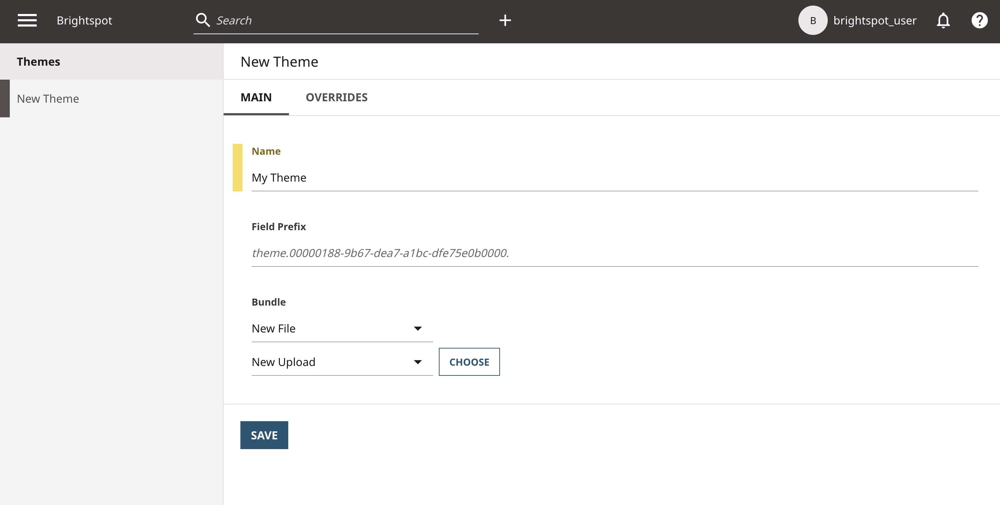
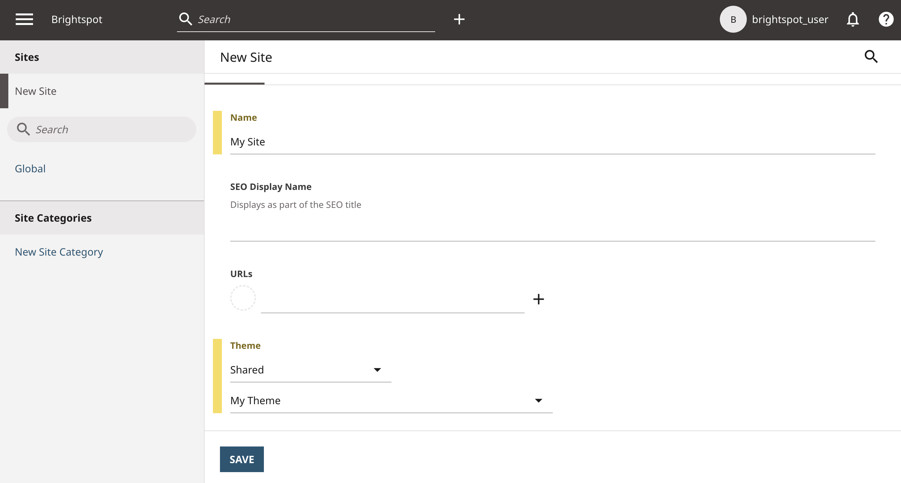
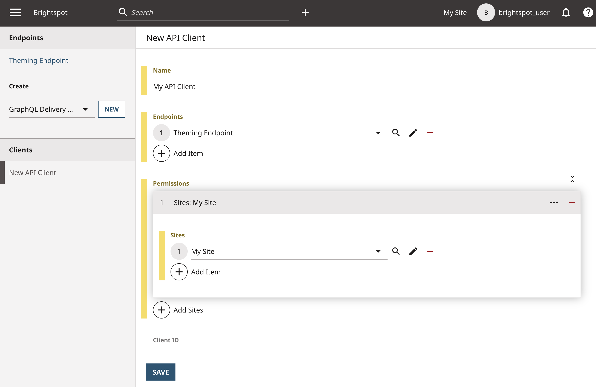
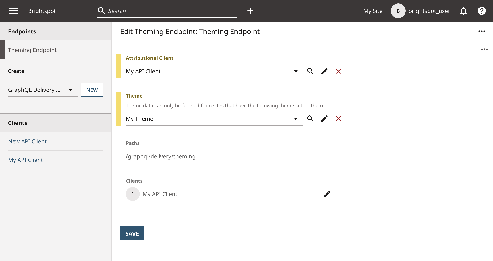
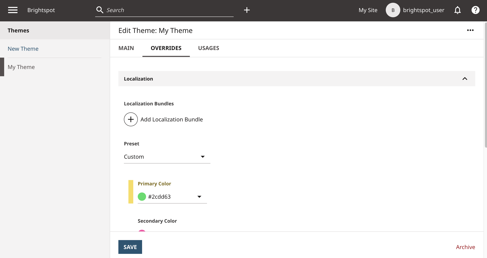
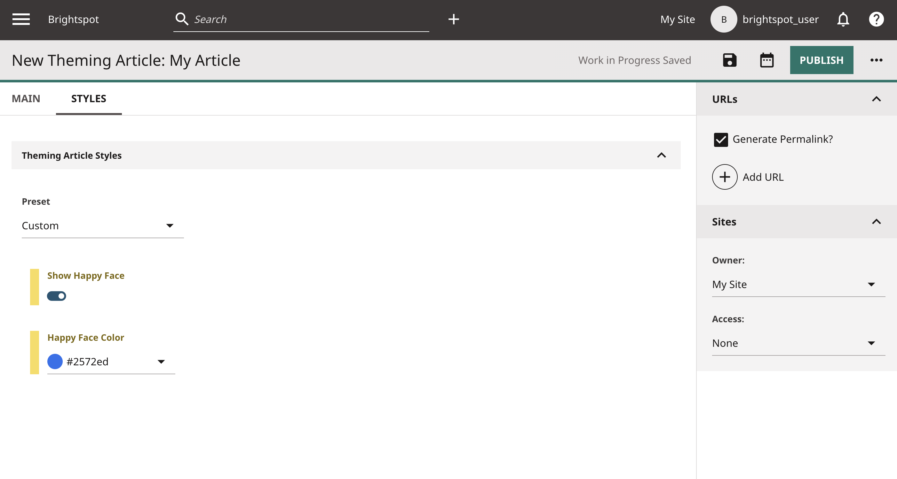

# Theming

Client-side applications using a Brightspot [Content Delivery API](https://www.brightspot.com/documentation/brightspot-cms-developer-guide/cda-guides) (CDA) may need presentation logic delivered via the API, but want that data decoupled from core data models. Brightspot provides a solution with [theming](https://www.brightspot.com/documentation/brightspot-cms-developer-guide/latest/data-modeling-for-themes).

This example demonstrates implementing Brightspot theming via a CDA endpoint to access presentation logic.

## What you will learn
1. [Create a theme](#step-1-create-a-theme).
1. [Configure theme global styling](#step-2-configure-theme-global-styling).
1. [Configure theme content-type styling](#step-3-configure-theme-content-type-styling).
1. [Add a theme to a CDA endpoint](#step-4-add-a-theme-to-a-cda-endpoint).

## Running the example application

**Note** Just starting? Refer to the [README](/README.md) at the root of the `react-examples` repository for details on running example applications. 

### Install dependencies

Run the following command from the `theming/app/` directory:

```sh
yarn
```

Wait until a message similar to `✨ Done in 5.03s` appears.


### Start the React app

```sh
yarn start
```
The React app opens automatically in the browser.

## Using the example application

**Note**: Unless otherwise specified, perform each of the following steps in the Brightspot CMS.

<details>
<summary>
<span>
<b>Generate a theme zip file</b>
</span>
</summary>

1. Change to `theming/brightspot/`.
1. Run `yarn run config`.

The built theme is in `custom-theme.zip`.

</details>

<details>
<summary>
<span>
<b>
Upload a theme
</b>
</span>
</summary>

1. In Brightspot, navigate to **&#x2630; > Admin > Themes > New Theme**.
1. In the **Name** field, add a name. 
1. Click **Choose**, and navigate to the generated `custom-theme.zip` file.
1. Click **Save**.


</details>

<details>
<summary>
<span>
<b>Add the theme to a site</b>
</span>
</summary>

1. Navigate to **&#x2630; > Admin > Sites & Settings > New Site**.
1. In the **Name** field, add a name. 
1. From the **Theme** list, select **Shared**, and then select theme you uploaded.
1. Click **Save**.


</details>

<details>
<summary>
<span>
<b>Create an API client</b>
</span>
</summary>

1. Navigate to **&#x2630; > Admin > APIs > Clients > New API Client**.
1. In the **Name** field, add a name. 
1. Under **Endpoints**, click &#x2295; and select **Theming Endpoint**.
1. Under **Permissions**, click &#x2295; and select the site you created.
1. Click **Save**.


</details>

<details>
<summary>
<span>
<b>Apply theme and API client to API endpoint</b>
</span>
</summary> 

1. Navigate to **&#x2630; > Admin > APIs > Theming Endpoint**.
1. From the **Attributional Client** list, select your API client.
1. From the **Theme** list select your theme.
1. Click **Save**.


</details>

<details>
<summary>
<span>
<b>Add theme global styles</b>
</span>
</summary>

1. Navigate to **&#x2630; > Admin > Themes > &lt;Theme Name&gt;**.
1. Under the **Overrides** tab, under **Preset**, select **Custom**.
1. Configure colors and typefaces for various front-end elements.
1. Click **Save**.
1. Refresh the front-end application page to see the applied overriding styles. 

These styling overrides are applied globally for the respective endpoint.


</details>

<details>
<summary>
<span>
<b>Add theme content-type styles</b>
</span>
</summary>

1. Click **+** next to the search field and select **Theming Article**.
1. In the **New Theming Article** form, enter a headline, unique slug, and body.
1. Click **&#x22EF; > Styles**.
1. Expand **Theming Article Styles**, and select **Custom** from the **Preset** list.
1. Select styling from the options available.
1. Click **Publish**.
1. Refresh the front-end application page to see the Theming Article and content-type styles.


</details>

## How everything works

### Step 1. Create a theme

Open the file [`brightspot/_config.json`](brightspot/_config.json). This file provides the core information for a theme. In order to configure global and content-type styling with a theme, a theme *must* have the following objects:

- `themeFields`: All children of this object are for theme global styling.
- `styles`: All children of this object are for theme content-type styling.

```json5
{
  "themeFields": {},
  "styles": {}
}
```

Brightspot accepts theme files as zip files. In this example, the theme zip file is generated by running the script `yarn run config`, which executes the [`config.mjs`](brightspot/config.mjs) file. 

### Step 2. Configure theme global styling

In the `themeFields` object, add children based on the following example. The name of each child object is the name that appears in the theme schema. The same is true for content-type styling fields. 
 
```json5
"themeFields": {
  "primaryColor": {
    "displayName": "Primary Color",
    "type": "color",
    "cms.ui.placeholder": "#ff0083"
  } 
}
```

Refer to the [data modeling for themes](https://www.brightspot.com/documentation/brightspot-cms-developer-guide/latest/data-modeling-for-themes#field-options) documentation to learn more about field types and field options. 

### Step 3. Configure theme content-type styling

In the `styles` object, add content-type styling objects based on the following example. The styling objects must have unique keys, such as `/themingArticle`, to associate content-type styles with a specified asset. All styling objects listed for the particular key are the styles that are available for the asset.

```json5
"styles": {
  "/themingArticle": {  // same name as @ViewTemplate value
    "fields": { // fields for asset
      "showHappyFace": {
        "type": "boolean"
      }
    }
    "/<someOtherViewInterface>": {
      "fields":  {...}
    }
  }
}   
```

The file [`ThemingArticleViewModel.ts`](brightspot/src/brightspot/example/theming/ThemingArticleViewModel.ts) contains an annotation `@ViewTemplate`. This annotation links styles from the theme configuration file to the specified asset's view interface. 

```typescript
@ViewInterface
@ViewTemplate({ value: '/themingArticle' }) // same name as the unique key under the styles object in the theme configuration file
export default class ThemingArticleViewModel extends JavaClass(
  'brightspot.example.theming.ThemingArticleViewModel',
  ViewModel.Of(ThemingArticle),
```

**Note**: The view template name must have a preceding forward slash, such as `@ViewTemplate({ value: "/themingArticle" })`.

### Step 4. Add a theme to a CDA endpoint

#### Define a theming endpoint

The file [`ThemingEndpoint.ts`](brightspot/src/brightspot/example/theming/ThemingEndpoint.ts) defines a theming endpoint. The endpoint must implement the `ContentDeliveryApiThemeable` interface to enable applying themes for that endpoint. The desired theme must be applied to the endpoint.

#### Retrieve global or asset-level theme

The file [`GetArticles.tsx`](app/src/queries/GetArticles.tsx) contains two objects:

- `_Theme`: When a theme is applied to an endpoint, the endpoint exposes a `_Theme` root field with global styling.

  ```graphql
  query GetArticles {
    _Theme {
      bodyFont
      alignment
      primaryColor
      primaryTextColor
      secondaryColor
      secondaryTextColor
    }
  }
  ```

- `_style`: Assets with the `@ViewTemplate` annotation expose this field. If the theme is not applied to a site, the value returned is null.

  ```graphql
  query GetArticles {
    ThemingArticles {
      themingArticles {
        _style {
          showHappyFace
          happyFaceColor
        }
      }
    }
  }
  ```

#### Apply styling fields

The file [`App.tsx`](app/src/App.tsx) applies styling fields to the front-end application. Below are some examples.

**CSS variables**

Applied to the root html element:

```tsx
root.style.setProperty('--primaryColor', themeData?.primaryColor || '#fff')
```

Scoped to a particular element:

```tsx
style={{ "--happyFaceColor": article._style?.happyFaceColor } as React.CSSProperties}
```

**Conditional rendering**

```tsx
{article._style?.showHappyFace && (...
```

**Data attributes**

```tsx
<h1 className="title" data-alignment={themeData?.alignment}>
```

The above options are just a few of the ways styling fields can be used in a front-end application. 

## Try it yourself

The following are suggestions for learning more about theming:

1. Add new `themeFields` or `fields`, and use those fields in your front-end application. 

   **Note**: Remember to generate a new theme zip file if you make changes to the `_config.json` file. Run `yarn run config` in the `brightspot/` directory to update the `custom-theme.zip` file. Then navigate to **&#x2630; > Admin > Themes**, and select your theme. Select **New File** to upload the new theme zip file, and save all updates.

1. Read the [Brightspot documentation](https://www.brightspot.com/documentation/brightspot-cms-developer-guide/latest/data-modeling-for-themes) on theming to learn more about theming. 

## Troubleshooting

You receive a validation error similar to the following:

```
There was an error fetching data: Validation error (FieldUndefined@[_Theme]) : Field '_Theme' in type 'Query' is undefined...
```

Make sure you added your theme to your endpoint (see "Apply theme and API client to API endpoint" in [Using the Example Application](#using-the-example-application)).

Having other issues running the example application? Refer to the [Common Issues](/README.md) section in the respository README for assistance.